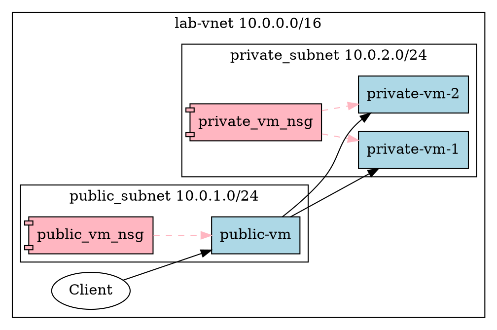

% Advanced networking lab


# Resource group creation

Today's lab will be done in `lab_rg` as usual.

## Delete if existing

If you haven't deleted `lab_rg` and its resources from last week you should do it now using:

```powershell
az group delete -n lab_rg
# may need to confirm with y
```

## Creation

As usual we'll create `lab_rg` in `westeurope` using:

```powershell
az group create -n lab_rg -l westeurope
```


# Scenario

Today we're going to consider a more advanced vnet configuration than we've seen to date:



Our network has:

- A **public subnet** with range 10.0.1.0/24 intended for controlled access from the public internet.
- A **private subnet** with range 10.0.2.0/24 intended for controlled access only from the public subnet, and not directly from the wider public internet.

**This is a very useful pattern for network design, aside from cloud environments.**


## VNet creation

Start by creating the VNet with the 10.0.0.0/16 prefix located in `westeurope`.

```powershell
az network vnet create -n lab_vnet -g lab_rg -l westeurope --address-prefix 10.0.0.0/16
```

Unlike when we create a VNet using the portal, we don't get a default subnet included.


## Subnet creation

We need now to create two subnets, `public-subnet` and `private-subnet`.
Each needs the VNet name to be associated correctly, and the non-overlapping range of IPv4 addresses.
*Azure will refuse to create overlapping subnet ranges so don't worry about that!*

```powershell
# for the public subnet
taz network vnet subnet create -n public_subnet -g lab_rg --vnet-name lab_vnet --address-prefix 10.0.1.0/24

# same for the private subnet
az network vnet subnet create -n private_subnet -g lab_rg --vnet-name lab_vnet --address-prefix 10.0.2.0/24
```


# Network security group

Last year we saw that AWS has security groups that implement a network-level firewall in front of EC2 instances.
Separately Network ACLs control traffic across subnets in a VPC. 

Azure blends both concepts together, with rules expressed in Network Security Groups that are attached to subnets and/or VMs.
The same NSG can technically be attached to a subnet and one or more VMs but generally the rules implemented will differ sufficiently that we won't want to do that.
In our example we're going to use NSGs attached to VMs only.

NSGs can be modified after they've been created and attached to subnets and/or VMs, so it is relatively easy to alter rules once they've been setup.


## Creation

Let's first create NSGs for the public network VM(s).

```powershell
az network nsg create -g lab_rg -n public_vm_nsg
```


## Listing the rules

We can at any time list the rules in the NSG using: 

```powershell
az network nsg rule list -g lab_rg --nsg-name public_vm_nsg
```

This will appear different to what's presented on the Portal, because (for some inexplicable reason) it lacks the default rules.
We can include them by passing the `--include-default` switch:

```powershell
az network nsg rule list -g lab_rg --nsg-name public_vm_nsg --include-default
```


## Adding rule

We'll now add a rule to our network security group to permit inbound SSH from anywhere.

```powershell
az network nsg rule create -g lab_rg --nsg-name public_vm_nsg --name AllowPublicSSH --protocol tcp --direction inbound --source-address-prefix '*' --destination-address-prefix '*' --destination-port-range 22 --access allow --priority 200
```


# Public VM

The public VM will be created here.
In contrast to what we've done so far we'll use the Azure CLI to create it.


## VM image list

To obtain a list of the available VM *images*

```powershell
az vm image list -p Canonical --all -o table 
```

We're going to use the `Canonical:ubuntu-24_04-lts:server:latest` image.


## Create the public IPv4 address

So far we've always created a public IP address automatically for our VMs so that we can connect directly to them from the outside.
The public IP to private IP NAT is done by Azure's VNet, so the public IP address does not appear on the VM itself.
Here we will create the public IP address explicitly.

```powershell
az network public-ip create -g lab_rg -n PublicVMIP
```


## Create the NIC

The Network Interface Card (NIC) is technically a distinct component from the VM.
Essentially it associates a virtual network interface in the VMs operating system to your subnet, hence the name.

NICs are normally created automatically when creating a VM.
Here we will create it explicitly so that we can associate the NSG that we created earlier.

```powershell
az network nic create -g lab_rg --name PublicNIC --vnet-name lab_vnet --subnet public_subnet --network-security-group public_vm_nsg --public-ip-address PublicVMIP
```


## Create the VM

We now have enough information to create the VM:

```powershell
az vm create -g lab_rg -n public-vm --location westeurope --nics PublicNIC  --image 'Canonical:ubuntu-24_04-lts:server:latest' --admin-username developer --admin-password 1Password  --size Standard_B1s
```

The public and private IP addresses will appear in the output.


## SSH connection

We can now connect over SSH as we're familiar with: 

```powershell
ssh developer@public-ip-address-here
```

If you notice issues with SSH authentication you may need to try

```powershell
ssh developer@public-ip-address-here -i ~/.ssh/id_rsa
```


# Private VM 1

Now, let's repeat the process for the private network security group following the same sequence as the public NSG:

## NSG Creation

```powershell
# create the NSG
az network nsg create -g lab_rg -n private_vm_nsg

# list out the rules (if needed, include defaults)
az network nsg rule list -g lab_rg --nsg-name private_vm_nsg --include-default
```

## NSG Rule

We will permit (in the first instance) SSH traffic from the *public subnet* to the private subnet's VMs.
We can do this with a very minor change to the SSH rule for the public subnet:

```powershell
az network nsg rule create -g lab_rg --nsg-name private_vm_nsg --name AllowSSHFromPublicSubnet --protocol tcp --direction inbound --source-address-prefix '10.0.1.0/24' --destination-address-prefix '*' --destination-port-range 22 --access allow --priority 200
```


## Private VM creation

The private VM is pretty similar to the public VM, except we don't have a public IP address.


```powershell
# Private NIC
az network nic create -g lab_rg --name PrivateNIC1 --vnet-name lab_vnet --subnet private_subnet --network-security-group private_vm_nsg

# Create VM
az vm create -g lab_rg -n private-vm-1 --location westeurope --nics PrivateNIC1  --image 'Canonical:ubuntu-24_04-lts:server:latest' --admin-username developer --admin-password 1Password  --size Standard_B1s
```

When the creation command returns, note that there is no Public IP address shown.


# Application: SSH Gateway

A very common situation is where we have 1 externally facing SSH server that is then used as a proxy to connect to other hosts that are not directly accessible.
This setup is often called a bastion host, jump host or jump box.


## Direct SSH to private VM 1

We can directly SSH to the private VM via the public VM using the `-J` switch of the SSH command.

```powershell
ssh -J developer@public-ip-here developer@private-ip-here
```


## Using keys

The SSH bastion host or jump box is often employed with SSH keys.


# Resource group deletion

When you've finished today's lab make sure to delete your `lab_rg` resource group (including its contents!)

```powershell
az group delete -n lab_rg
# may need to confirm with y
```

Don't close the shell session until the deletion has completed!


# Additional commands for reference


### Associating the NSG

Then we can associate it to the relevant subnet (where we need to repeat a few parameters like VNet name and resource group name):

```powershell
az network vnet subnet update -n private_subnet --network-security-group private_subnet_nsg -g lab_rg --vnet-name lab_vnet
```
