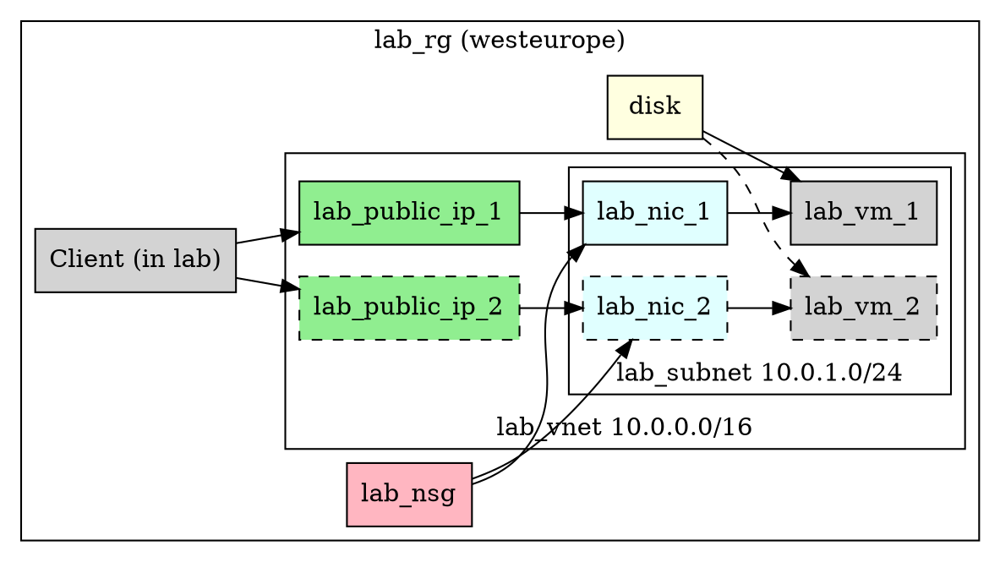

% Azure disks

**Required reading:** [Virtual Machines Documentation Azure Disks](https://learn.microsoft.com/en-gb/azure/virtual-machines/managed-disks-overview)

In today's class we will look at block storage options in Azure.
We've already considered file storage previously.

**Observations:**

- Note that a lot of today's concepts around storage, disk partitions etc are not specific to Azure or indeed to the Cloud at all.
- We've already met some of the ideas when we covered AWS Elastic Block Storage.
- In consumer devices a lot of the operations below aren't obvious any more, but they do happen!


# Setup

## Portal login

Make sure that you can login to the [Azure portal](https://portal.azure.com).


# Resource group creation

Create `lab_rg` located in `westeurope` using the CLI.


# Infrastructure

This week we'll again create our VNet by hand.
We've only one Subnet as previously.




## Network setup

Our network setup will be based on previous week's lab.
Use last week's lab as a guide to create the VNet, Subnet (only 1), Network Security Group, Public IP Address and NIC.
Although you *can* copy and paste the full command list below, you should go through it and make sure you understand what each does:


```powershell
# create the vnet
az network vnet create -n lab_vnet -g lab_rg -l westeurope --address-prefix 10.0.0.0/16

# create the subnet (in lab_vnet)
az network vnet subnet create -n lab_subnet -g lab_rg --vnet-name lab_vnet --address-prefix 10.0.1.0/24

# create the network security group
az network nsg create -g lab_rg -n lab_nsg

# create the public IP address (to attach later)
az network public-ip create -g lab_rg -n lab_public_ip_1

# create the NIC (w/ public IP attached)
az network nic create -g lab_rg --name lab_nic_1 --vnet-name lab_vnet --subnet lab_subnet --network-security-group lab_nsg --public-ip-address lab_public_ip_1
```


## VM setup

The VM is to be created on B1s size using Ubuntu 24.04. 

```powershell
az vm create -g lab_rg -n lab-vm-1 --location westeurope --nics lab_nic_1  --image 'Canonical:ubuntu-24_04-lts:server:latest' --admin-username developer --admin-password 1Password2025.  --size Standard_B1s
```


## NSG Rules

### Attempt connection

Attempt to log into the VM over SSH through its public IP.
It will fail.
Why?


### Add rule

Add the rule to the NSG to allow access over SSH:

```powershell
az network nsg rule create -g lab_rg --nsg-name lab_nsg --name AllowSSHFromInternet --protocol tcp --direction inbound --source-address-prefix '*' --destination-address-prefix '*' --destination-port-range 22 --access allow --priority 200
```


### Re-try connection

Try again to connect.
It should now work.


# Disk exploration

We're going to use some linux commands to explore the disks, filesystems and devices on the VM.


## Mount command

First let's show the devices on the linux VM.
The `mount` command is used both to mount/unmount filesystems from the root filesystem on the linux VM and to display currently mounted filesystems.


```bash
mount
```

The output will be very lengthy.
Many of these are *virtual filesystems*, or parts of the OS kernel that expose themselves as files. 
We can use the `grep` command to filter this output so that only "real" filesystems are shown.

```
mount | grep /dev
```

Notice that there are *two* disks shown: `/dev/sda` and `/dev/sdb`.


## Findmnt (optional)

A newer alternative to `mount` is called `findmnt` and displays its output in a more readable way.

```bash
findmnt
```

Output like

```
TARGET                         SOURCE      FSTYPE      OPTIONS
/                              /dev/sda1   ext4        rw,relatime,discard,errors=remount-ro,commit=30
├─/dev                         devtmpfs    devtmpfs    rw,nosuid,noexec,relatime,size=428716k,nr_inodes=107179,mode=755,inode64
│ ├─/dev/shm                   tmpfs       tmpfs       rw,nosuid,nodev,inode64
│ ├─/dev/pts                   devpts      devpts      rw,nosuid,noexec,relatime,gid=5,mode=620,ptmxmode=000
│ ├─/dev/hugepages             hugetlbfs   hugetlbfs   rw,nosuid,nodev,relatime,pagesize=2M
│ └─/dev/mqueue                mqueue      mqueue      rw,nosuid,nodev,noexec,relatime
├─/proc                        proc        proc        rw,nosuid,nodev,noexec,relatime
│ └─/proc/sys/fs/binfmt_misc   systemd-1   autofs      rw,relatime,fd=32,pgrp=1,timeout=0,minproto=5,maxproto=5,direct,pipe_ino=1170
│   └─/proc/sys/fs/binfmt_misc binfmt_misc binfmt_misc rw,nosuid,nodev,noexec,relatime
├─/sys                         sysfs       sysfs       rw,nosuid,nodev,noexec,relatime
│ ├─/sys/kernel/security       securityfs  securityfs  rw,nosuid,nodev,noexec,relatime
│ ├─/sys/fs/cgroup             cgroup2     cgroup2     rw,nosuid,nodev,noexec,relatime,nsdelegate,memory_recursiveprot
│ ├─/sys/fs/pstore             pstore      pstore      rw,nosuid,nodev,noexec,relatime
│ ├─/sys/firmware/efi/efivars  efivarfs    efivarfs    rw,nosuid,nodev,noexec,relatime
│ ├─/sys/fs/bpf                bpf         bpf         rw,nosuid,nodev,noexec,relatime,mode=700
│ ├─/sys/kernel/debug          debugfs     debugfs     rw,nosuid,nodev,noexec,relatime
│ ├─/sys/kernel/tracing        tracefs     tracefs     rw,nosuid,nodev,noexec,relatime
│ ├─/sys/fs/fuse/connections   fusectl     fusectl     rw,nosuid,nodev,noexec,relatime
│ └─/sys/kernel/config         configfs    configfs    rw,nosuid,nodev,noexec,relatime
├─/run                         tmpfs       tmpfs       rw,nosuid,nodev,size=172600k,nr_inodes=819200,mode=755,inode64
│ ├─/run/lock                  tmpfs       tmpfs       rw,nosuid,nodev,noexec,relatime,size=5120k,inode64
│ └─/run/user/1000             tmpfs       tmpfs       rw,nosuid,nodev,relatime,size=86300k,nr_inodes=21575,mode=700,uid=1000,gid=1000,inode64
├─/boot                        /dev/sda16  ext4        rw,relatime,discard
│ └─/boot/efi                  /dev/sda15  vfat        rw,relatime,fmask=0077,dmask=0077,codepage=437,iocharset=iso8859-1,shortname=mixed,errors=remount-ro
└─/mnt                         /dev/sdb1   ext4        rw,relatime
```

## Disk free

We can get the free space using

```bash
df -h
```

The `-h` switch uses human-readable quantities rather than number of bytes.


## Block devices

The VM apparently has two "physical" disks, or block devices.
The word physical here is a bit misleading since the disks themselves are virtually provisioned on Azure's infrastructure.


## Listing block devices

The `lsblk` command will show block devices and their partitions. 


## Viewing partition table

Each disk is split into partitions defined by the *partition table*.

We can view the partition table for the first disk using:

```bash
sudo gdisk -l /dev/sda
```

This will firstly reveal the type of partition table:

```
Partition table scan:
  MBR: protective
  BSD: not present
  APM: not present
  GPT: present
```

The above shows that the disk has a GPT partition table present, and a *protective MBR* to show that a GPT partition table is present.
A protective MBR helps prevent accidentally deleting a GPT partition table if an MBR partition editor is loaded up.

Next we see that there are 4 partitions:

```
Number  Start (sector)    End (sector)  Size       Code  Name
   1         2099200        62916574   29.0 GiB    8300  
  14            2048           10239   4.0 MiB     EF02  
  15           10240          227327   106.0 MiB   EF00  
  16          227328         2097152   913.0 MiB   EA00  
```


### Type code

We can use the partition type codes to see what the table indicates the partition is:

```bash
sgdisk -L | grep 8300
```

### /dev/sdb

Do the same steps above for `/dev/sdb` and note the difference(s).


# Azure disk provisioning

We're now going to create an Azure disk and attach it to our VM.
This can be done via the portal or via the CLI.


## Disk creation and attachment

Create a new 5GB disk and attach it to our VM.

```powershell
az vm disk attach -g lab_rg --vm-name lab-vm-1 --name lab_disk --new --size-gb 5
```


## Finding the disk

On the VM run

```bash
lsblk
```

Note that we now have an extra line (probably `sdc`) for the new disk.


## Partitioning

We'll now create a partition table on the drive.

### Starting parted

You can either pass a complete command to `parted` or use it interactively as we'll do here.
To start it:

```bash
sudo parted /dev/sdc
```

Output should look like:

```
GNU Parted 3.6
Using /dev/sdc
Welcome to GNU Parted! Type 'help' to view a list of commands.
(parted)
```

Try the suggested help option to view the inbuilt help.


### Creating partition table

To create the partition table as GPT type run:

```
mklabel gpt
```

There'll be no output.
To print the partition table you can run `p`.
Output should include:

```
Partition Table: gpt
```


### Creating partition

Next we'll create a linux-compatible (ext4) partition using the command:

```
mkpart linuxpart ext4 0% 100%
```

Print the partition table again and confirm that your new partition shows up.


### Exiting parted

Type `q` and enter to exit `parted`.


## Confirming layout

Use `lsblk` again and confirm that you now see not only the new disk but the newly-created partition as well.


## Filesystem creation

We indicated in the partition table that the new partition would be type ext4 for linux.
Here we will actually create it:

```bash
sudo mkfs -text4 /dev/sdc1
```


## Mounting

Mounting is where the OS attaches the filesystem on a partition to a given mount point.


### Mountpoint creation

To do this we will first create the mountpoint:

```bash
sudo mkdir -p /mnt/data
```

### Mount

We can then mount the drive:

```bash
sudo mount -text4 /dev/sdc1 /mnt/data
```


### Confirming

Use `mount` or `findmnt` to confirm that the new disk has indeed been mounted.
At this point it can be used as any other.


## Testing the filesystem

At this point the filesystem can be used like any other. 


## Auto-mounting on boot

By editing the `/etc/fstab` file we can have the OS automatically mount the filesystem when the machine boots.


# Resource group deletion

Delete the `lab_rg` and visually confirm that no VMs are left running when complete.
