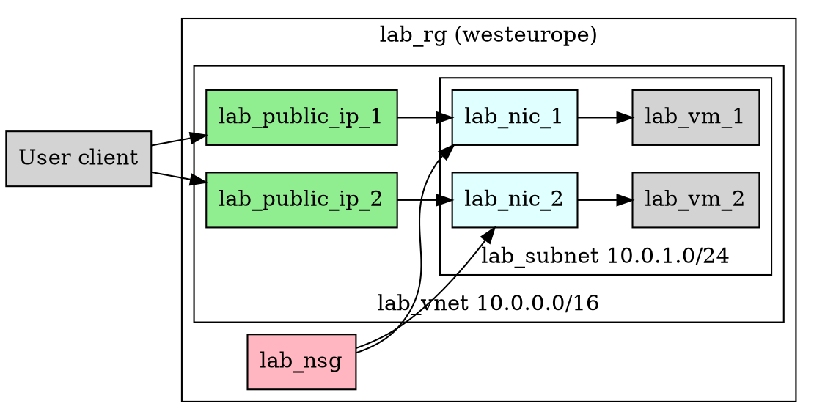
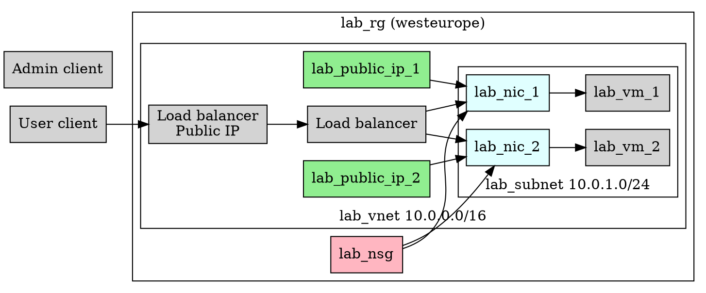
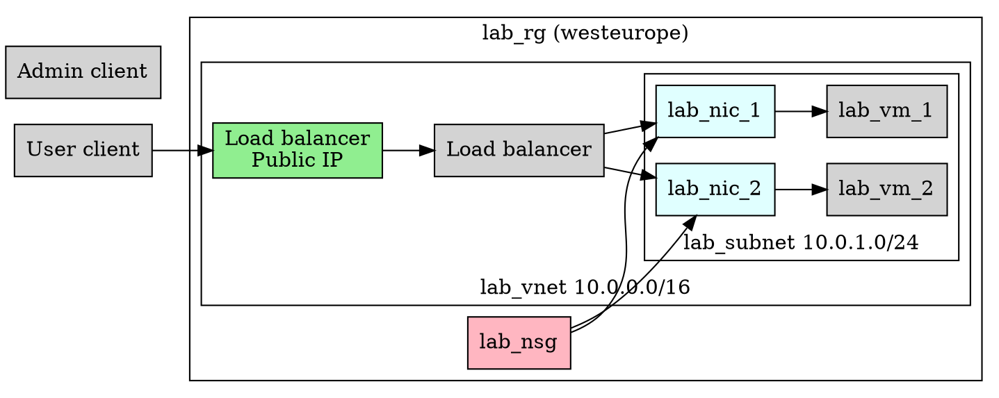
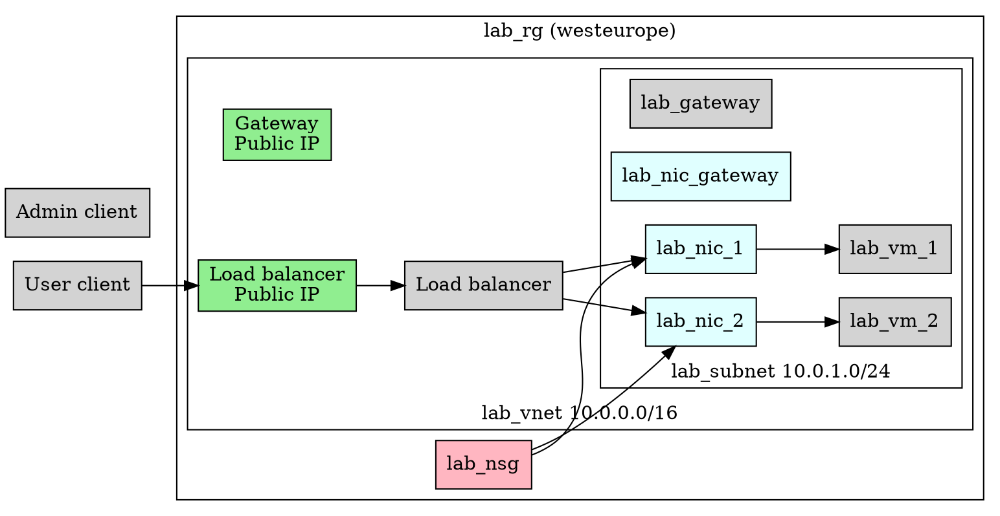

% Azure load balancer lab

**Important links:**

- [Azure load balancer documentation](https://learn.microsoft.com/en-us/azure/load-balancer/load-balancer-overview)


In this lab we'll take a look at load-balanced configuration, where incoming traffic is distributed among 2 or more backend VMs. 
The Azure network setup is similar to previous weeks. 

Reasons for load balancing: 

- Enables capacity adjustment
- Cost optimisation
- Allows redundancy in case of malfunction
- Facilitates auto-scaling (but doesn't do the scaling for you!)


# Setup

## Portal login

Make sure that you can login to the [Azure portal](https://portal.azure.com).


# Resource group creation

Create `lab_rg` located in `westeurope` using the CLI.


# Scenario



## Network setup

Our network setup will be based on previous week's lab.
Use last week's lab as a guide to create the VNet, Subnet (only 1), Network Security Group, Public IP Address and NIC.
Although you *can* copy and paste the full command list below, you should go through it and make sure you understand what each does:


```powershell
# create the vnet
az network vnet create -n lab_vnet -g lab_rg -l westeurope --address-prefix 10.0.0.0/16

# create the subnet (in lab_vnet)
az network vnet subnet create -n lab_subnet -g lab_rg --vnet-name lab_vnet --address-prefix 10.0.1.0/24

# create the network security group
az network nsg create -g lab_rg -n lab_nsg
```


## VM setup

The 2 VMs are to be created on `B1s` size using Ubuntu 24.04. 
Instructions for the first VM:

```powershell
# create the public IP address (to attach later)
az network public-ip create -g lab_rg -n lab_public_ip_1

# create the NIC (w/ public IP attached)
az network nic create -g lab_rg --name lab_nic_1 --vnet-name lab_vnet --subnet lab_subnet --network-security-group lab_nsg --public-ip-address lab_public_ip_1

# machine 1
az vm create -g lab_rg -n lab-vm-1 --location westeurope --nics lab_nic_1  --image 'Canonical:ubuntu-24_04-lts:server:latest' --admin-username developer --admin-password 1Password2025.  --size Standard_B1s 
```

**Do the same again** for `lab-vm-2`, creating a second public IP, NIC and VM **replacing 1 with 2 where appropriate.**
*You'll need to read the commands in detail for this!*


## NSG rules

```powershell
az network nsg rule create -g lab_rg --nsg-name lab_nsg --name AllowSSHFromInternet --protocol tcp --direction inbound --source-address-prefix '*' --destination-address-prefix '*' --destination-port-range 22 --access allow --priority 200
```

## Confirm connectivity

Use SSH to confirm that you can reach both VMs on their public IPs.


# Load balancer Scenario

Now let's add a load balancer so that connecting to one public IP will get us routed to one of the two VMs.




## Public IP

The load balancer is going to have its own public IP.
Let's create it now, named `lab_lb_public_ip` exactly as before:

```powershell
# create the public IP address (to attach to load balancer)
az network public-ip create -g lab_rg -n lab_lb_public_ip
```


## Load balancer creation in Portal

In the portal go to Azure Load Balancer, hit *Create*.


## Basics

Choose `lab_rg` Resource group.

Name: `lab-lb`.

Set **Type** to **Public**.

Leave all other settings alone.
Hit **Next**.


## Frontend IP configuration

On this page click *Add a frontend IP configuration*.

This attaches our public IP address to the load balancer.

**Name:** `lab_frontend`

Drop **Public IP address** down to `lab_lb_public_ip`. 

Leave all other settings alone.
Hit **Save** and then **Next**.


## Backend pools

The backend pool is a group of VMs that are available to serve incoming requests from the load balancer. 

Click *Add a backend pool*.

**Name:** `lab-backend`

**Virtual network:** `lab_vnet`

**Backend Pool Configuration:** NIC

Under **IP Configurations** click *Add*.

Tick the 2 VMs in the list.

Hit **Add**, then **Save**.


## Inbound rules

Under **Load balancing rule** click *Add a load balancing rule*.

**Name:** ssh

**Frontend IP address:** `lab-frontend`

**Backend pool:** `lab-backend`

**Protocol:** TCP

**Port:** 22

**Backend port:** 22


### Health probe

Under **Health Probe** click *Add new*. 

**Name:** ssh

**Protocol:** TCP

**Port:** 22

Leave everything else alone and hit **Save**.


You can then go ahead and hit **Review and Create**, then **Create**.


# Usage

The load balancer by design should ensure that we don't know what backend machine we are connecting to, but that illusion can be easily broken. 


## SSH host keys

In the case of SSH we have host keys that the client verifies.

Obviously if the client gets connected to a different VM, the host key verification will fail.

You can get around this by removing the host key from your local machine:

```powershell
ssh-keygen -R public-ip-here
```

The only way around this is to copy the relevant host keys so they're identical. Or setup a *Certificate Authority* if you really want to! 


## Handling VM failure

Stop one of the VMs, and wait until the status becomes `Stopped (deallocated)`. 

Try to connect.

You should get connected to the second one.


# Direct VM access

As currently configured, direct VM access is possible using their Public IPs.
Ideally we would avoid the backend pool machines having Public IPs at all:



## Disassociating / delete public IPs

```powershell
# Dissociate the public IP address from the IP configuration
az network nic ip-config update --name ipconfigmyVM --resource-group lab_rg --nic-name lab-nic-1 --public-ip-address null

# Delete the public IP address

```


This now means we can't access any particular member of the backend pool directly.


## Bastion host

We can get around this by creating a Bastion host (as before):



Let's first create the gateway public IP, NIC and VM:

```powershell
# public IP
az network public-ip create -g lab_rg -n lab_gateway_public_ip

# nic
az network nic create -g lab_rg --name lab_gateway_nic --vnet-name lab_vnet --subnet lab_subnet --network-security-group lab_nsg --public-ip-address lab_gateway_public_ip

# VM
az vm create -g lab_rg -n lab-gateway-vm --location westeurope --nics lab_gateway_nic  --image 'Canonical:ubuntu-24_04-lts:server:latest' --admin-username developer --admin-password 1Password2025.  --size Standard_B1s 
```


# Backend uniformity

The load balancer configuration itself only provides the means to distribute incoming connections among a number of backend VMs.
It doesn't actually ensure that the machines are in any way identical at all.
This is the job of other tools - whether custom / cloned images, cloud-init or ansible playbooks. 


# Non-cloud applicability

Most of the ideas here apply to non-cloud environments as well.

A hardware load balancer can be deployed in front of a number of backend machines in a pool (including VMs) to distribute the incoming connections among them.
The configuration is very similar to that shown here.


# Reminder - delete resources

**Very important** that you delete resources from this week - with multiple VMs, public IPs and load balancer your Azure credit could get exhausted quickly!
Delete everything when you're finished.

```powershell
az group delete -n lab_rg
```

