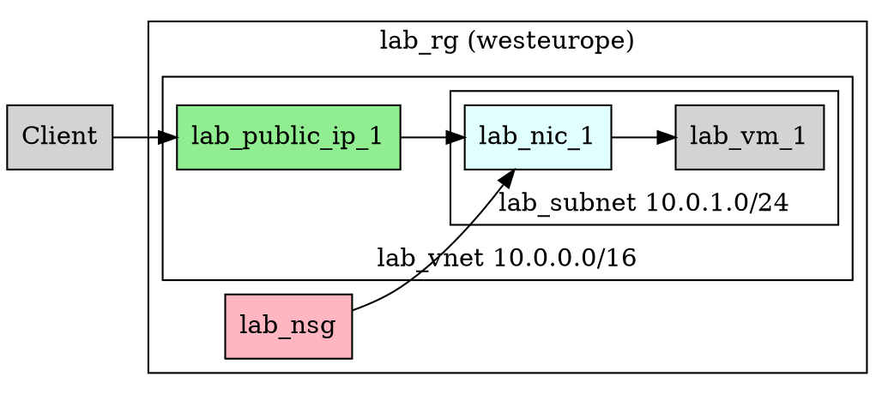

In today's lab we'll start looking at how GitLab CI can build a basic Java application with a view to deploying it to Azure VMs. 
Today's class will mainly focus on the mechanics of the CI process using GitLab and its runners.

Similar facilites exist within GitHub and other full-featured source control systems as well.

*This class was adapted from one I did using XOA rather than Azure VM.
There may be a couple of references to XOA here but you can substitute Azure VM for them!*


# Continuous integration

[Continuous integration](https://en.wikipedia.org/wiki/Continuous_integration) technically refers to merging changes back into the main branch as often as possible:

-   Idea originated to combine work of developers in teams as soon as possible.

-   Key idea (even for a solo developer) is that code is compiled, tested, packaged and deployed automatically on every commit.
	

## Continuous delivery

CI has evolved into [continuous delivery (CD)](https://en.wikipedia.org/wiki/Continuous_delivery) where the same processes deliver final products / artefacts to end users. 


## Pre-requisites

Practical usage depends on:

Source control

:   system to record changes and trigger actions.

CI toolset

:   to automate the process


## CI in software development

CI can be used to automate any task, typically:

-   Confirming that code compiles correctly without errors (for compiled
    languages like Java, C# etc.)

-   Running automated tests (e.g. unit tests, integration tests).

-   Packaging code or executables into ZIP or other distribution formats (e.g. apk, pkg, MSI installers).

-   Generating other artefacts like screenshots, documentation, webpages etc.

-   Installing code on test (or production!) environments.

-   Announcing updated status using email, Slack, Teams, IRC, Twitter via APIs and bots.

-   Updating metrics, dashboards, team visualisations etc.

Just as you should be using source control (as of 2025 git) for any project, you should consider some element(s) of CI.
*Every time I've started a project and didn't have time to automate its deployment / delivery I've regretted it!*


## CI for Cloud Architecture Students

Some specific ideas for cloud architecture students:

1.  Deploying a Java or C# application to a VM in the cloud.

2.  Deploying cloud infrastructure from CI/CD. 


## Basic idea

Regardless of how we perform our CI, the basic steps remain the same.
The CI tool should:

1.  Cleanly **clone** the repository in full.

2.  **Run** the action steps specified.

	- This might include a deployment step.
	
	- This might include the creation of cloud resources necessary (more advanced!)

3.  **Report** the outcome of the steps.

4.  **Save artefacts** created (if required). 

Reporting and saving can be done either by the CI tool itself or scripts
in the repository.


## Requirements

For any CI to work:

::: center
**We must be able to run the build step as a sequence of deterministic
commands, ideally a single command.**
:::

How this works does not matter, but typically:

1.  Makefile based on targets / dependencies using `make`.

2.  Script in bash, PowerShell, Python, other language.

3.  Language-specific build tool like Maven for Java.

Unless you can repeatably run your build steps:

- Without intervention
- Outside your IDE environment
- On a machine that isn't your desktop

Then you won't be able to run them successfully under CI.


## Artefacts

Often we want to save some (not all) files generated during the build
process.

-   Reporting data about testing, performance, sample output etc.

-   Files intended for distribution:

    -   MSI installer from source code for Windows

    -   APK app for an android mobile phone
	
	-   JAR or WAR file for Java application

    -   Sample input / output from testing.

In many other cases the CI/CD pipeline will deploy the project into a production or production-like environment.
This is increasinly becoming the case!


## CI tooling

There are 3 options:

1.  **Roll your own** using git, git hooks and bash / python scripts.

	- There's a great educational value to doing this if you have time!

2.  **Standalone CI server** like Jenkins, Travis.

	- Becoming less common nowadays but still widely utilised.

3.  **Integrated CI solutions** using source control hosts like GitLab,
    GitHub etc.

	- Git mainly used with GitLab / GitHub, so integrated option now makes sense in most cases.

In this lab we'll move forward with **GitLab CI**.
Most of the ideas are reasonably portable to other CI systems.


# GitLab CI

To automate actions on commit we need:

Pipeline

:   that defines the steps to perform

Executor

:   environment that will run the steps

Runner

:   service to orchestrate:

    1.  Creating the executor

    2.  Running the pipeline
	

Build Host

:   server machine or VM that has the Runner service and executor installed.


## Pipeline

The pipeline defines the commands to execute:

-   Stored as file in repository as `.gitlab-ci.yml`

-   Pipelines vary in complexity:

    -   Simplest pipelines (as we'll use today) just run single (set of)
        commands when repository updated.

    -   More complex pipelines introduce depedencies, stages, rules etc.

*Personally I'm not a fan of too much complexity in your GitLab pipeline.
Do as much of the work in a standard non-GitLab specific tool and just call it from the gitlab-ci pipeline.
Never duplicate steps!
Have all the work defined in ONE place ONLY!*
	

## Build machine

Runner and executor are separate to GitLab itself:

-   Need to be installed on a suitable computer (here a linux virtual
    machine) that

-   Should be on all the time, so can continuously communicate with
    GitLab.

-   Could be a machine on the network, in the cloud etc.

The host needs to be able to contact the GitLab server over HTTPS. 
In our lab today we'll use an Azure VM as the host. 

*I've also used XOA Linux instance(s) to host the runner and provide the
executor.
You may want to investigate this for cost reasons if XOA meets your needs for some projects.*


## Executor

The executor is the environment used by the runner to run the pipeline.
Common executors:

Shell

:   executor uses the default system shell (e.g. bash on linux,
    PowerShell on Windows)

    -   Installed already so no further configuration needed.

    -   Issue: required packages etc need to be installed manually.
	

Docker

:   executor uses the docker container system

    -   Needs to be separately setup.

    -   Advantage: build environment can be setup in repository.

For today's lab we'll use the shell executor.


## Runner

The runner needs to be installed on our XOA instance:

-   The runner communicates with GitLab continuously.

-   When new commits are pushed to the repository the runner:

    -   Invokes the pipeline using the executor

    -   Reports progress back to GitLab for display

    -   Captures defined artefacts and sends them to GitLab

-   The runner normally is installed as a separate Linux user
    specifically designated for this purpose.
	

# Recommendations

-   You must have your build process scripted to begin with.

-   You should use the same script(s) to build both locally and in your
    CI pipeline.


# Project

A basic Java App called `TrainTimes` is provided.
You are welcome to try this lab with one of your own apps following the same workflow.
If you do, you might encounter a minor issue around JDK/JVM versions.
It's easy to fix if it occurs.


## Forking the project

The `TrainTimes` project is set up on GitLab.
Here you will use the *fork* feature on GitLab to make your own personal copy of it:

1. Log in to [the school GitLab instance](https://gitlab.comp.dkit.ie).
1. Navigate to: https://gitlab.comp.dkit.ie/grantp/TrainTimes .
2. Click **Fork**.
3. On the next page that appears click **Fork project**.
4. You'll be taken to your own copy of `TrainTimes`.


## Cloning the code

1. Change to your desktop using `cd ~/Desktop`. (You can use any other folder, but don't use any folder within the `cloud_architecture` folder which is itself a git repository. Bad things can happen with git repositories are nested within other git repositories!)
2. Clone *your own* fork of the `TrainTimes` using the appropriate `git clone` command given on the GitLab project page.


## Open in your IDE

This is a Maven project.
I originally created it in IntelliJ, but it should load any Maven compliant IDE.
*I haven't tested it in any other.*

Open it in your IDE and confirm that you can build and run it.
The very basic project does very little!


# Azure infrastructure





## Infrastructure setup

You're already familiar with the infrastructure needed, so let's use a PowerShell script `./azure_build_setup.ps1` to create our Azure environment.

```powershell
./azure_build_setup.ps1
```


# Testing build on Build VM

Login to the build VM over SSH.


### Cloning repository

Clone your repository using the same clone link that you used for cloning on your local PC.
You will need your DkIT username and password for GitLab when asked.

```bash 
git clone https://url/of/repo/here
```


### Checking for required tools

First let's check that the build tools we need are installed.
Both of these commands should give the full path to the tool.
If the command replies with nothing then the tools needed aren't installed.

```bash
# check that the java compiler is installed
which javac

# check that maven is installed
which mvn
```


### Running the build

Now let's try to get Maven to build our project.

```bash
# change into dir
cd TrainTimes

# run maven
mvn package
```


### Running the JAR file

Test run the JAR file in the `target` subdirectory.


# GitLab Runner Setup

## Runner installation


These steps will set up the runner on your own XOA machine.

1. Use SFTP to copy `./runner_install.sh` to your VM.
2. Make the runner script executable using `chmod +x ./runner_install.sh`.
3. Run the `./runner_install.sh` script.
4. You will need to enter your VM password when prompted.
5. The installation may take some time.


## Linking the runner to the project

1. On GitLab go to your fork of the `TrainTimes` project.
2. Click *Settings* and then *CI/CD*. 
3. Find *Runners* on the screen and click *Expand*.
4. Click *New project runner*.
5. Choose *Linux* on the next screen.
6. **Important!** Make sure to turn on *Run untagged jobs*.
7. Click *Create runner*.
8. Under Step 1 on the next screen, copy the command onto your Azure VM with `sudo` infront of it.
You may need to enter your machine password here.
	- If you get a yellow WARNING type Ctrl-C to exit.
	- Re-run the command with `sudo` in front of it as instructed.
9. Press enter to accept the default GitLab URL.
10. Press enter to accept the default runner name.
11. When it asks `Enter an executor` type `shell` and press enter.
12. Finally click *View runners*.
13. You should see a green dot under *Assigned project runners*.


## Manually running the pipeline

We will now manually run the pipeline to confirm all works (it probably won't):

1. In your `TrainTimes` project on GitLab go to *Build/Pipelines*.
2. Click *Run pipeline*. 
3. Click *Run pipeline* on the next screen also.
4. If it fails, look at the reason. Usually it's a missing command.
5. On your XOA machine install the missing command(s) and re-try step 4 until it works.

By default a failing pipeline will e-mail you from GitLab.
It will also mail you the first time that a pipeline that previously failed runs successfully.


## Automatically running the pipeline

In your clone of the repository on your local PC, make a change to project (can be very small).
Make sure it compiles and runs.

Commit and push the change.

Look at your GitLab under *Build/Jobs* and see that your pipeline has automatically run after a short time.

This will happen regardless of where your repo is pushed from, even from changes made in the interactive GitLab screens. 


## End 

If you have got this far then you have successfully set up your runner and executor and have linked them to your GitLab repository so that your pipeline can run when commits are pushed.


# Issues

Today's lab is a very basic introduction:

-   We are really just using CI here as a trigger to run our script:

    -   We could do a lot more in terms of selective reporting if tests
        or other processes fail.
		
	-   Opinions vary as to whether to do more work in the CI or external scripts.

-   Our build environment is not self-contained and is dependent on the
    machine hosting the runner.

    -   Ideally our build environment should be reproducible some way.

    -   Consider container, virtualisation or automated package setup.

    -   Could consider using the *Docker* runner.

- We could now do some deployment tasks from this!


# Alternative / optional: self-setup


## Copy project to desktop

First let's copy the app out of the lab git repository to your Desktop.
To do this run the following PowerShell command

```powershell
Copy-Item -Path "TrainTimes" -Destination "~/Desktop" -Recurse
```


## Initialise the git repo

First let's initialise the Git repository, add all files and commit them.
To do this we'll run:

```powershell
# initalise the repository
git init -b main

# add all files (except .gitignore'd files)
git add .

# commit
git commit -m 'initial commit'
```


